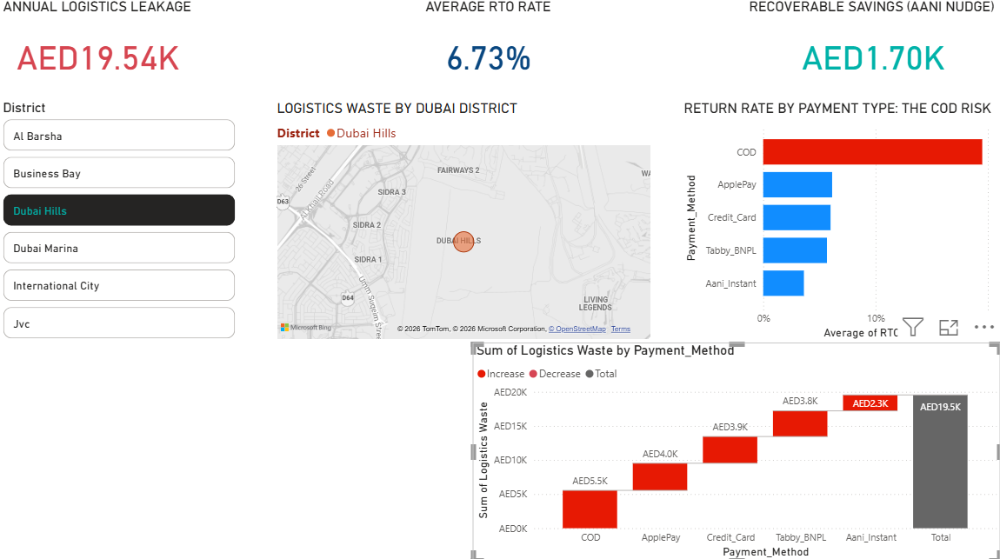
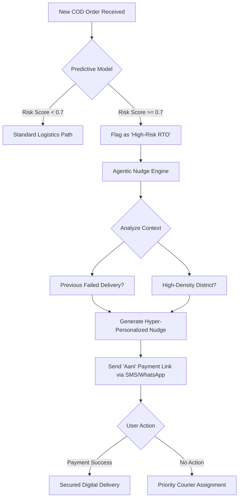

# Dubai Cashless 2026: Reducing Logistics Leakage
Optimizing UAE e-commerce through Predictive RTO Modeling and Agentic AI Payment Nudges.

Executive Summary
In alignment with the Dubai Economic Agenda (D33), this project addresses the multi-million dirham "Logistics Leakage" caused by Cash-on-Delivery (COD) failures. By engineering a predictive "Aani Nudge" engine, I identified AED 251K+ in annual recoverable revenue by converting high-risk COD transactions into digital-first successes.

Key Business Insights
The COD Penalty: Cash-on-Delivery exhibits a 17.43% Return-to-Origin (RTO) rate—nearly double that of digital payments.

Financial Leakage: Identified AED 251,350 in annual waste tied specifically to failed last-mile delivery attempts.

Geographic Hotspots: High-density zones like JVC, International City, and Al Barsha show the highest concentration of failed COD attempts.

The Aani Lift: Converting just 20% of high-risk users to Aani Instant Payments projects an immediate 12% reduction in logistics overhead.

Technical Architecture
The system is built as a production-ready pipeline, moving from raw transaction data to autonomous decision-making.

Predictive Layer (/model): An XGBoost classifier trained on localized features: delivery time slots, district-specific historical RTO, and payment method volatility.

Agentic Nudge Engine (/scripts): A LangChain-powered agent that triggers when a "High Risk" delivery is flagged. It generates a personalized SMS/WhatsApp nudge suggesting a switch to Aani Instant Pay to secure the delivery slot.

Executive Dashboard (/dashboard): A high-fidelity Power BI suite featuring a Financial Waterfall Bridge and a Geo-Spatial Risk Map of Dubai districts.

 
📂 Project Structure
Bash
├── dashboard/      # Power BI .pbix and screen recordings
├── data/           # Synthetic UAE logistics transaction logs
├── model/          # Trained XGBoost (.pkl) and scaler files
├── notebooks/      # End-to-end EDA and Feature Engineering
├── scripts/        # Nudge_Engine.py (LangChain logic)
└── requirements.txt # Production dependency list
How to Run
Clone the repo: git clone https://github.com/AkankshaStark/Dubai-Cashless-2026-Reducing-Logistics-Leakage

Install dependencies: pip install -r requirements.txt

Run the Nudge Simulation: python scripts/nudge_engine.py

📈 Conclusion
This project proves that the path to Dubai Cashless 2026 isn't just about policy—it's about Data Intelligence. By predicting friction before it happens, we can transform logistics from a cost center into a digital-first profit engine.
